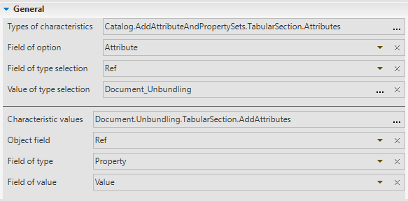
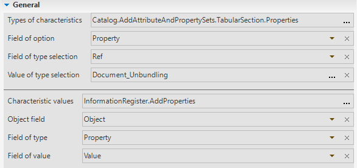
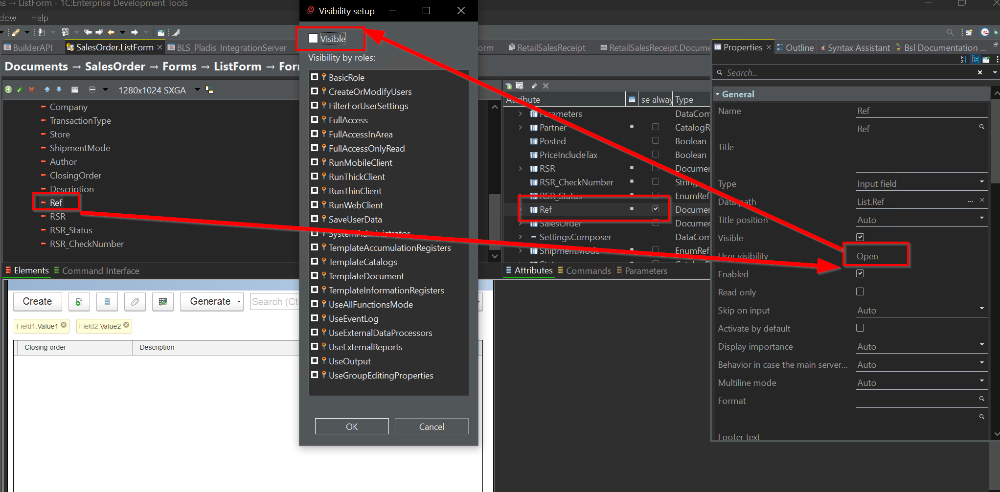
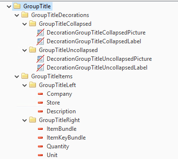
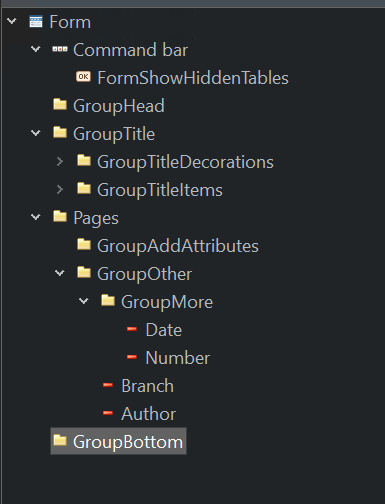

При создании документа в метадатах:

## Main
- [ ] Fill Synonym
- [ ] Fill Object presentaion
- [ ] Fill List presentation
- [ ] Code type - `Number`
- [ ] Lenght - `12`
- [ ] Non periodical
- [ ] Create on input = `Don't use`
- [ ] Add to subsystem
- [ ] Add to functional option
- [ ] Set common attribute Use: `Author, Branch, Description, SourceNodeID`
- [ ] RealTimePosting = `Deny` 
- [ ] Add to `FilterCriteria` - `RelatedDocuments` add to content and to button
- [ ] Add to content `FullExchange` in `Plan Exchange`

## Access
- [ ] Copy any document Role and rename to `Document_DocName`. Set all right to this role, except `Delete`. Check, that `Restiction template` is filled.
- [ ] Add `Access restriction` to `Read`, `Insert`, `Update`:
```bsl
#CheckDocumentAccess()
```
- [ ] Do the same with role `TemplateDocument`
- [ ] Remove interactive Delete from role `FullAccess`
- [ ] Add read and View to role `FullAccessOnlyRead`
- [ ] Add to role `FilterForUserSettings` `Read` and `View`. And set attribute for using in `Default Settings` (`Catalog Users` - in header `Settings`)
- [ ] Add to Object Manager module:
```bsl
#Region AccessObject

// Get access key.
// 
// Parameters:
//  Obj - DocumentObjectDocumentName -
// 
// Returns:
//  Map
Function GetAccessKey(Obj) Export
	AccessKeyMap = New Map;
	//AccessKeyMap.Insert("Company", Obj.Company);
	//AccessKeyMap.Insert("Branch", Obj.Branch);
	//StoreList = Obj.ItemList.Unload(, "Store");
	//StoreList.GroupBy("Store");
	//AccessKeyMap.Insert("Store", StoreList.UnloadColumn("Store"));
	Return AccessKeyMap;
EndFunction

#EndRegion
```
## Add attributes
- [ ] In `Catalog.AddAttributeAndPropertySets` add new predefined document with name `Document_DocumentName`, set description as `Document Document name`.
- [ ] Copy from `document SalesOrder` table `AddAttributes` and setup it:



## Set refs
- [ ] Add to `Defined types` - `typeAddPropertyOwners`
- [ ] Add to `Defined types` - `typeObjectWithItemList` (if table `ItemList` is exists)
- [ ] Add to command refs in report `DocumentRegistrationsReport`
- [ ] Add form `DocumentForm`, `ListForm`, `ChoiceForm`. Order is important.
- [ ] In list and choise form - `Dynamic list` - `Ref` - set `See always` = `True`. Move Ref column to the end and go to `User visibility` - `Visible` - set `False`:


## Common modules
If in the document we add 2 attributes `Company` and `Store`
- [ ] Create new common modules `DocDocumentNameClient`, :
```bsl
#Region FORM
// Template for extension
Procedure OnOpen(Object, Form, Cancel) Export
	Return;
EndProcedure

#EndRegion

#Region _DATE
// Template for extension
Procedure DateOnChange(Object, Form, Item) Export
	Return;
EndProcedure

#EndRegion

#Region COMPANY
// Template for extension
Procedure CompanyOnChange(Object, Form, Item) Export
	Return;
EndProcedure

Procedure CompanyStartChoice(Object, Form, Item, ChoiceData, StandardProcessing) Export
	OpenSettings = DocumentsClient.GetOpenSettingsStructure();

	OpenSettings.ArrayOfFilters = New Array();
	OpenSettings.ArrayOfFilters.Add(DocumentsClientServer.CreateFilterItem("DeletionMark", True,
		DataCompositionComparisonType.NotEqual));
	OpenSettings.ArrayOfFilters.Add(DocumentsClientServer.CreateFilterItem("OurCompany", True,
		DataCompositionComparisonType.Equal));
	OpenSettings.FillingData = New Structure("OurCompany", True);

	DocumentsClient.CompanyStartChoice(Object, Form, Item, ChoiceData, StandardProcessing, OpenSettings);
EndProcedure

Procedure CompanyEditTextChange(Object, Form, Item, Text, StandardProcessing) Export
	ArrayOfFilters = New Array();
	ArrayOfFilters.Add(DocumentsClientServer.CreateFilterItem("DeletionMark", True, ComparisonType.NotEqual));
	ArrayOfFilters.Add(DocumentsClientServer.CreateFilterItem("OurCompany", True, ComparisonType.Equal));
	DocumentsClient.CompanyEditTextChange(Object, Form, Item, Text, StandardProcessing, ArrayOfFilters);
EndProcedure

#EndRegion
```

- [ ] Create new common modules `DocDocumentNameServer`:
```bsl
#Region FORM

Procedure OnCreateAtServer(Object, Form, Cancel, StandardProcessing) Export
	DocumentsServer.OnCreateAtServer(Object, Form, Cancel, StandardProcessing);
	If Form.Parameters.Key.IsEmpty() Then
		SetGroupItemsList(Object, Form);
		DocumentsClientServer.ChangeTitleGroupTitle(Object, Form);
	EndIf;	
EndProcedure

Procedure AfterWriteAtServer(Object, Form, CurrentObject, WriteParameters) Export
	DocumentsClientServer.ChangeTitleGroupTitle(CurrentObject, Form);
EndProcedure

Procedure OnReadAtServer(Object, Form, CurrentObject) Export
	If Not Form.GroupItems.Count() Then
		SetGroupItemsList(Object, Form);
	EndIf;
	DocumentsClientServer.ChangeTitleGroupTitle(CurrentObject, Form);
	LockDataModificationPrivileged.LockFormIfObjectIsLocked(Form, CurrentObject);
EndProcedure

#EndRegion

#Region GroupTitle

Procedure SetGroupItemsList(Object, Form)
	AttributesArray = New Array();
	AttributesArray.Add("Company");
	AttributesArray.Add("Store");
	DocumentsServer.DeleteUnavailableTitleItemNames(AttributesArray);
	For Each Attr In AttributesArray Do
		Form.GroupItems.Add(Attr, ?(ValueIsFilled(Form.Items[Attr].Title), Form.Items[Attr].Title,
			Object.Ref.Metadata().Attributes[Attr].Synonym + ":" + Chars.NBSp));
	EndDo;
EndProcedure

#EndRegion

#Region ListFormEvents

Procedure OnCreateAtServerListForm(Form, Cancel, StandardProcessing) Export
	DocumentsServer.OnCreateAtServerListForm(Form, Cancel, StandardProcessing);
EndProcedure

#EndRegion

#Region ChoiceFormEvents

Procedure OnCreateAtServerChoiceForm(Form, Cancel, StandardProcessing) Export
	DocumentsServer.OnCreateAtServerChoiceForm(Form, Cancel, StandardProcessing);
EndProcedure

#EndRegion

```
## Form module
### Document form module
- [ ] You need to find the most similar document to the one you need, for example - whether it has a table part 'ItemList' or not, and copy the code from there. Main regions:
    - FORM
    - _DATE
    - COMPANY
    - SERVICE
- [ ] Copy Form attribute:
    - Description (String)
    - GroupItems (ValueList)
- [ ] Copy command:
    - ShowHiddenTables

- [ ] Copy from other document GroupTitle.



- [ ] Copy Group `GroupHead`, `Page`, `GroupBottom`. It can be empty. It has to be like that:


### Document List and Choise form module
- [ ] You need to find the most similar document to the one you need, for example - whether it has a table part 'ItemList' or not, and copy the code from there. Main regions:
    - FormEvents
    - Commands

## Posting
- [ ] Add in module manager template
```bsl
#Region PrintForm

Function GetPrintForm(Ref, PrintFormName, AddInfo = Undefined) Export
	Return Undefined;
EndFunction

#EndRegion

#Region Posting

Function PostingGetDocumentDataTables(Ref, Cancel, PostingMode, Parameters, AddInfo = Undefined) Export
	Tables = New Structure;
	QueryArray = GetQueryTextsSecondaryTables();
	Parameters.Insert("QueryParameters", GetAdditionalQueryParameters(Ref));
	PostingServer.ExecuteQuery(Ref, QueryArray, Parameters);
	Return Tables;
EndFunction

Function PostingGetLockDataSource(Ref, Cancel, PostingMode, Parameters, AddInfo = Undefined) Export
	DataMapWithLockFields = New Map;
	Return DataMapWithLockFields;
EndFunction

Procedure PostingCheckBeforeWrite(Ref, Cancel, PostingMode, Parameters, AddInfo = Undefined) Export
	Tables = Parameters.DocumentDataTables;
	QueryArray = GetQueryTextsMasterTables();
	PostingServer.SetRegisters(Tables, Ref);
	PostingServer.FillPostingTables(Tables, Ref, QueryArray, Parameters);
EndProcedure

Function PostingGetPostingDataTables(Ref, Cancel, PostingMode, Parameters, AddInfo = Undefined) Export
	PostingDataTables = New Map;
	PostingServer.SetPostingDataTables(PostingDataTables, Parameters);
	Return PostingDataTables;
EndFunction

Procedure PostingCheckAfterWrite(Ref, Cancel, PostingMode, Parameters, AddInfo = Undefined) Export
	CheckAfterWrite(Ref, Cancel, Parameters, AddInfo);
EndProcedure

#EndRegion

#Region Undoposting

Function UndopostingGetDocumentDataTables(Ref, Cancel, Parameters, AddInfo = Undefined) Export
	Return PostingGetDocumentDataTables(Ref, Cancel, Undefined, Parameters, AddInfo);
EndFunction

Function UndopostingGetLockDataSource(Ref, Cancel, Parameters, AddInfo = Undefined) Export
	DataMapWithLockFields = New Map;
	Return DataMapWithLockFields;
EndFunction

Procedure UndopostingCheckBeforeWrite(Ref, Cancel, Parameters, AddInfo = Undefined) Export
	QueryArray = GetQueryTextsMasterTables();
	PostingServer.ExecuteQuery(Ref, QueryArray, Parameters);
EndProcedure

Procedure UndopostingCheckAfterWrite(Ref, Cancel, Parameters, AddInfo = Undefined) Export
	Parameters.Insert("Unposting", True);
	CheckAfterWrite(Ref, Cancel, Parameters, AddInfo);
EndProcedure

#EndRegion

#Region CheckAfterWrite

Procedure CheckAfterWrite(Ref, Cancel, Parameters, AddInfo = Undefined)
	Return;
EndProcedure

#EndRegion

#Region Posting_Info

Function GetInformationAboutMovements(Ref) Export
	Str = New Structure;
	Str.Insert("QueryParameters", GetAdditionalQueryParameters(Ref));
	Str.Insert("QueryTextsMasterTables", GetQueryTextsMasterTables());
	Str.Insert("QueryTextsSecondaryTables", GetQueryTextsSecondaryTables());
	Return Str;
EndFunction

Function GetAdditionalQueryParameters(Ref)
	StrParams = New Structure;
	StrParams.Insert("Ref", Ref);
	Return StrParams;
EndFunction

#EndRegion

#Region Posting_SourceTable

Function GetQueryTextsSecondaryTables()
	QueryArray = New Array;
	Return QueryArray;
EndFunction

#EndRegion

#Region Posting_MainTables

Function GetQueryTextsMasterTables()
	QueryArray = New Array;
	Return QueryArray;
EndFunction

#EndRegion

```